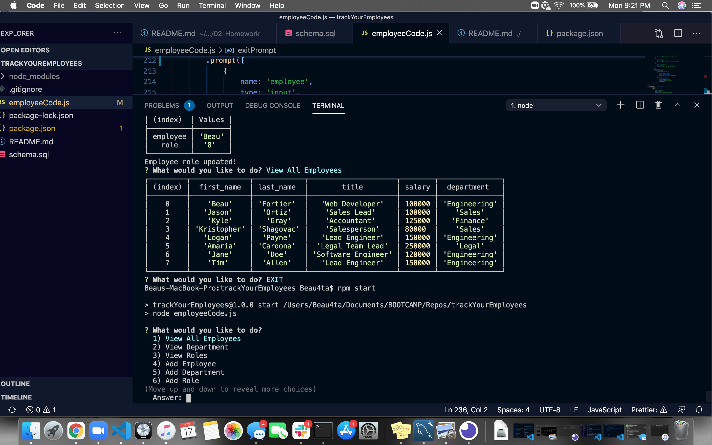

# Track Your Employees

  ## Description
  As a business owner I want to be able to view and manage the departments, roles, and employees in my company So that I can organize and plan my business.

  ## Table of Contents
  - [Description](#description)
  - [Installation](#installation)
  - [Usage](#usage)
  - [License](#license)
  - [Contributing](#contributing)
  - [Tests](#tests)
  - [Questions](#questions)

  ## Installation
  npm install, also install inquirer and mysql dependencies

  ## Usage
  npm start

  ## License
  N/A
  
  ## Contributing
  Beau Fortier

  ## Tests
  No tests were involved

  ## Questions
  Email me 
  
  GitHub: [Beau4ta](https://github.com/Beau4ta)
  
  Email me with any questions: beaufortier13@gmail.com
  
  Here is a link to the walkthrough video: https://drive.google.com/file/d/1vphTHxrdwW_qUT7yl97X_z4sGGXT4Ktz/view

  

